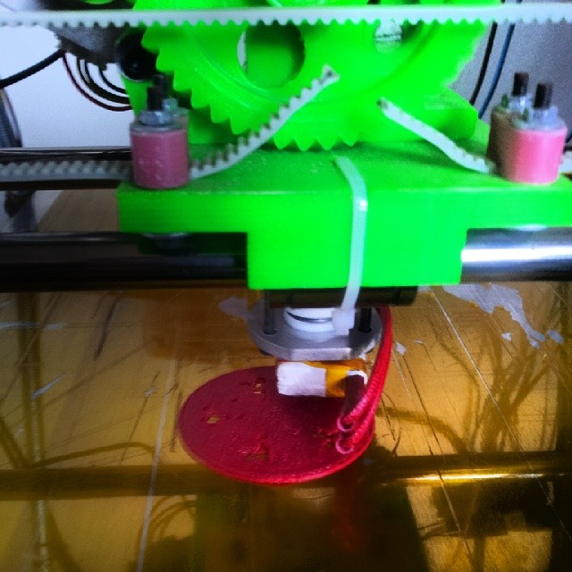

# Starting the hardware part

I'm so excited with the idea that I'll work with hardware. So, each week I feel the things going on! And I'm happy with that!

## Hardware bought

After a long time looking and trying to understand motors I bought the first part of the pieces to build a real panel for the mandalas.

I decide to buy a "beagle bone black" because I'm confortable on linux, so I think it can be less painful than work with arduino and modules properly.

I think I'll be able to host the own app on the hardware too.

So, yesterday I bought:

* [BeagleBone Black][1]
* 1 Mini Hdmi to Hdmi Adapter - I want to connect it on my tv too :)
* 1 Micro Servo Motor 9g Tower Pro Sg90 - to start understand the motors

I don't know about the motor above, but I think it can be useful to start my tests.

## 3D printer working!

So, today I spent my whole day trying to configure our [reprap](http://reprap.org) to printing some [epicyclic gears](http://bl.ocks.org/mbostock/1353700) and now it's working!

The idea is to attach the mandalas over each gear. I start doing it small and I'll do it proportional to fit the mandalas. It was just my 'hello world' on the 3d printer world.

It's not easy to work with these. It's extremmely sensible and differs so much from a simple 'cmd-P' to print something.

I got problems around try to:

* create a simple flow while trying and retrying
* wait the bed and extruder hits the expected temperature
* save the first right setup to print something

So, now it's working and I expect to start doing it in the right metrics to fit the real painted mandalas over the gears.

## First book already scanned

So, @eliegejachini sent me the first book scanned. I'll update the images later.

Using scanner, the job was simplified and the images quality is so much better. We combined to keep the original images and the cropped mandalas together to keep the colorizer signature visible in a view too.

## Animations with scales

On the last saturday I was working in my first animation mixing rotate and scale. It was so cool and I really interested in bring the first experience based on a unique experience with the mandala.

So, my idea is show each one mandala rotating alone before zoom out to see the panel. The effect was so cool. Looks like I'm seeing through a 3D scenario.
