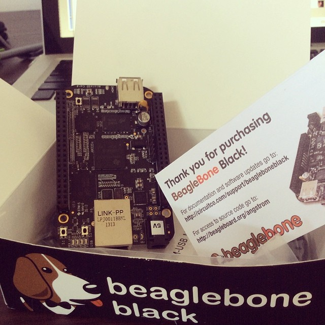

# Carnaval

Today is carnaval here in Brazil, and I'm getting time to work more on my project.

## The beaglebone black

My beaglebone black (BBB) is here, but I'm facing some bugs with that.

My first experience was awesome. The first time it just works on my usb connected to my mac. I connected it and the usb driver and it was recognized. I open the START.htm into the usb drive and start configuring my beaglebone.

So, everything was right. I run the examples, led in, led off, and all is completely working. So, it's time to connect via ssh and recognize the environment :) (I thought)

When I start the shell via root I really feel confortable. I start hacking everything and suddenlly I try the "reboot" command.

I don't know what b****t I did, but after reboot, the beaglebone stops recognizing on the usb drive! I really lost the connection I don't know why.

So, googling around I found other guys with the same problem. Everybody suggests to flash the beaglebone version to the latest image. I got some images from angstrom and ubuntu, but I found some craps on the download. So, now I'm downloading the image again, and now I'll really remember to verify the md5sum :)

The developer life is really a kind of art. To survive to problems like these above is something unimaginable that takes a lot of unexpected hours of work. To be a developer, and try something new, you really want to be open for that. It's really part of the game!

The first stepper motor I got is here and I couldn't test yet because I just broke my beaglebone.

## require("bonescript")

In other hand, with my first impressions on hands on, I think it'll be easy to mix my current web animation with the real motors accelaration.

Use bonescript is cool. I use node in the latest years and mix the bonescript events with the current pure html will be easy.

The beaglebone runs nodejs by default and I'll serve the mandala web application in a node server mixing the bonescripts to acomplish to the real acceleration as the animation does on the website.

## Other things I bought

To use the hdmi, I really need to put some other addons on my beaglebone black, so I bought:

* a usb hub to allow multiple usb's
* wifi adapter
* keyboard

I bought a 5v power but looks like it doesn't work.

I expect after flash it'll work. I'm anscious to put the hands on that.

## Things I worked on the website

I put to work the animation I imagined and it's really cool effect. I start exchange the mandalas by scaling it to zero and flowing it up rotating. I need to put a "skip animation" because I'm getting crazy with that!

The animation time was 8 seconds. I don't know how much patience the people will have to 'watch' the mandalas exchanging. I think I'll keep just 2 switches and show  all in the same time.

I'm confused around the images scrool horinzontally or vertically. By default I'll keep it vertical.

I'm working in another animation using a rotating mandalas algorithm. It's awesome. I really enjoy and I'm hacking his code to keep the animation infinite and exchanging the colors.

My color picker algorithm is weak and the animation doesn't make much sense. Perhaps, I'll keep it black and accelerate the animation to keep the background dark in the same time it flow the two first mandalas.

A lot of ideas on the first entries is coming on. I believe these initial animation will bring a cool mixing between algorithmic and real art.
